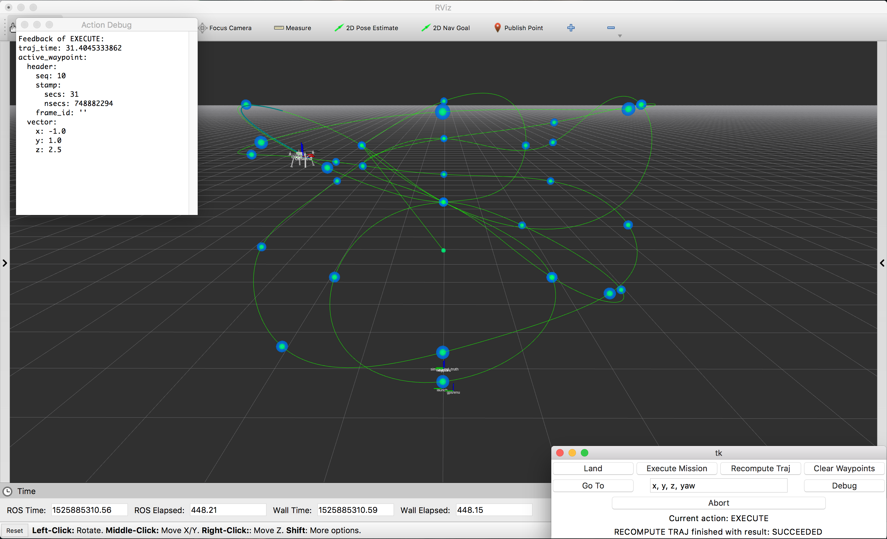

## Trajectory-Following Demo

This example demonstrates how to publish waypoints to `snav_ros` for smooth
trajectory generation and how to use the `snav_ros` action server through
a simple GUI to take off, execute a trajectory-following mission, and land.



### Start Qualcomm Navigator

First, make sure that `snav` is running. It is a good idea to run `snav` in
simulation mode the first time you try the demo to make sure that everything
looks normal before running it for real.

To run `snav` in simulation mode, SSH or ADB into the robot and run the
following commands:

```bash
# run these commands on the robot
sudo stop snav
sudo snav -w 1000
```

### Launch the ROS nodes on the robot

Next, launch the `qflight_descriptions` node. For example, if you are using the
Dragon DDK and the Qualcomm Flight board:

```bash
# run this command on the robot
roslaunch qflight_descriptions qflight_robot.launch vehicle:=ddk board:=sdf
```

Next, launch the `snav_ros` node on the robot:

```bash
# run this command on the robot
roslaunch snav_ros snav_ros.launch
```

### Launch the ROS nodes on the host

On the host computer, start the visualization and command GUI:

```bash
# run this command on the host
roslaunch snav_gui traj_follow_demo.launch
```

This will start rviz, launch a node to publish markers for waypoints, open the
command GUI, and open a dynamic reconfigure window. The command GUI stays on
top of all windows for ease of access.

Once rviz opens, you can open the `traj_follow_demo.rviz` config file included
in the `snav_gui` repo to get started or you can add your own display types.

### Publish the waypoints

`snav_ros` subscribes to the `planner/waypoints/input` topic for waypoints to
be used in trajectory generation. An example script is provided with `snav_ros`
to demonstrate reading waypoints from a yaml file and publishing them. To
run the script:

```bash
# run these commands on the robot
roscd snav_ros
rosrun snav_ros waypoint_publisher.py waypoints/waypoints.yaml
```

After you run this script, you should see the waypoints appear in rviz along
with the generated trajectory. If the trajectory generation had failed, only
the waypoints would appear in rviz.

### Execute the mission

Use the GUI to trigger actions via the action server. Click the "Takeoff"
button to cause the vehicle to spin the props, ascend to the takeoff altitude
(which is dynamically reconfigurable), and hover in place.

Before executing the trajectory, you may wish to view some characteristics of
the path such as maximum velocity or acceleration to be commanded or total
trajectory execution time. To do this, first click the "Debug" button on the
command GUI to open a debug window and then click the "Recompute Traj" button
on the command GUI. The debug window should be populated with feedback
information from the recompute action. If you leave the window open, you will
see feedback from other actions as well.

Once you are satisfied that the trajectory is reasonable and are ready to begin
the mission, click the "Execute Mission" button on the command GUI. The vehicle
should begin executing the planned trajectory. At any point during execution,
you can click the "Abort" button on the command GUI to stop the mission and
cause the vehicle to hover in place.

When the mission is over, simply click the "Land" button to cause the vehicle
to land in place or use the "Go To" button and text box to command the vehicle
to go to a specific location prior to landing followed by "Land". The
propellers stop once the vehicle is on the ground.

### Use dynamic reconfigure to adjust parameters

By default, the parameters governing the trajectory generation result in
relatively slow trajectories. Try adjusting the `planner_average_speed_xy` and
`planner_average_speed_z` parameters to get different results, but beware that
there are parameters governing the maximum allowed velocities and
accelerations, so changing these parameters may cause the trajectory generation
to fail. See the [`snav_fci`
README](https://github.com/ATLFlight/snav_fci#i-like-ricky-bobby-wanna-go-fast)
to get more information about how to enable faster flights.

